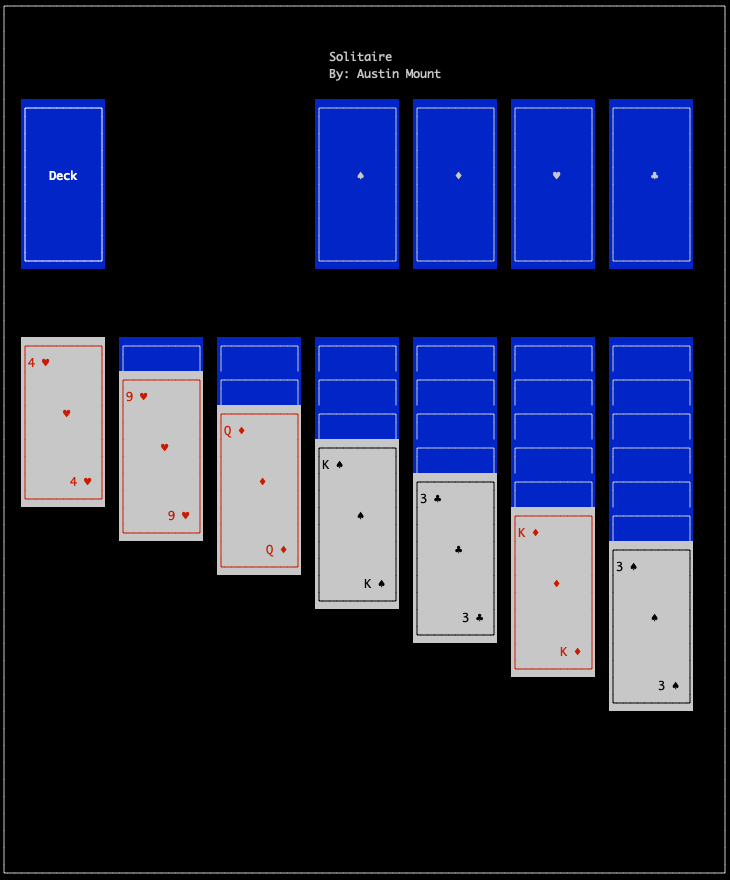

# curses_solitaire

### requirements

* UTF-8 encoding/locale

### known bugs

* errors if stack gets to long to fit on screen
* some refesh issues with the deck and turning when using 3 card draw
* if you play the cards turned it doesn't grab the last one yet
* probably a few more

### usage

* q - quite
* t - turn cards from deck
* SPACE - select current card
* TAB - change current stack
* UP - change current card up in stack
* Down - Change current card down in stack
* ENTER - move selected card to current stack or to completed stack if current = selected
* F2 - deal/start new game

### screenshot

